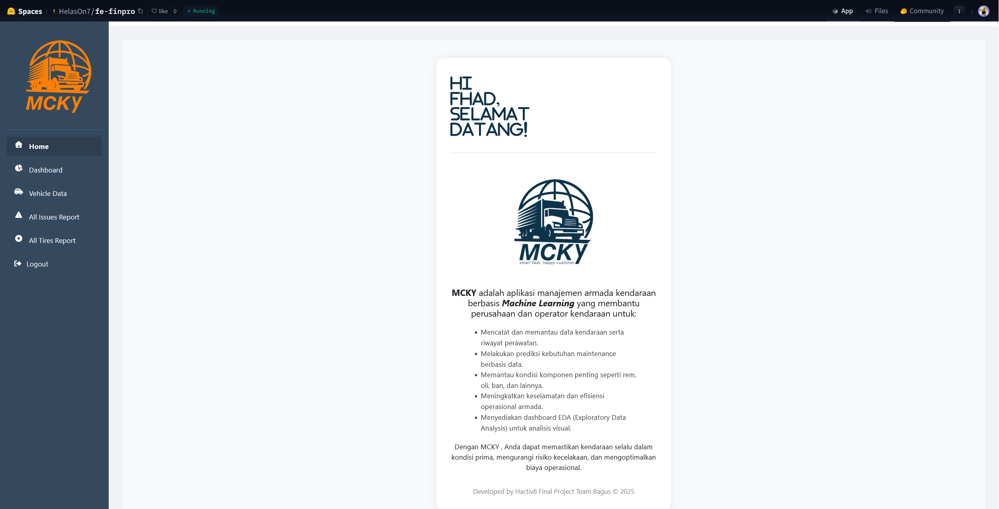
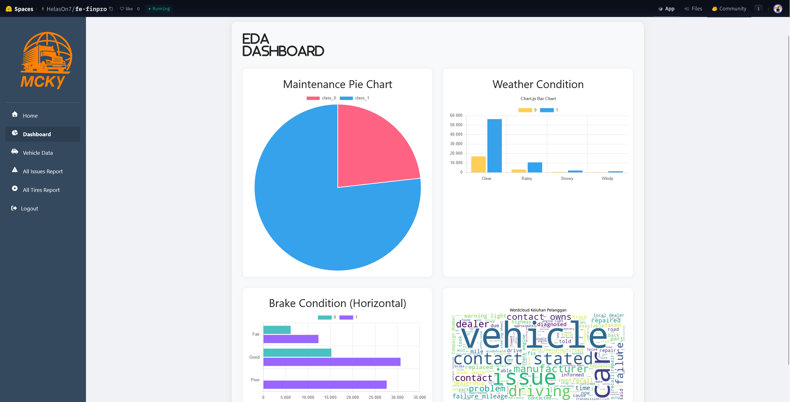
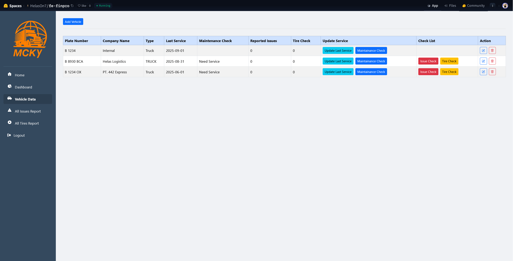
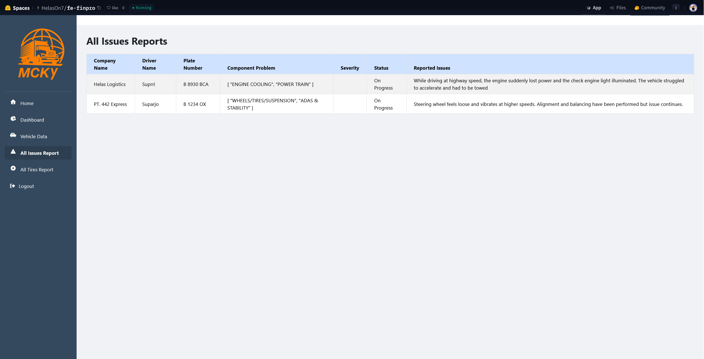

# MCKY – Maintenance Check and Safety for Fleet

> Predictive maintenance system to monitor fleet health, detect potential issues, and provide actionable insights for logistics companies.

---

## Repository Outline

1. **README.md** – Project overview & documentation.  
2. **notebooks/** – Jupyter Notebooks for the ML pipeline (EDA, modeling, inference):  
   - 01_ModelCNN_Tire_Textures_EDA.ipynb – EDA for tire textures (CV)  
   - 02_ModelCNN_Tire_Textures_Model.ipynb – Model development (CV)  
   - 03_ModelCNN_Tire_Textures_Inf.ipynb – Inference (CV)  
   - final_project_RMT45_01.ipynb – Main notebook (EDA, regression, NLP, CV)  
   - final_project_RMT45_01_inference.ipynb – Inference pipeline  
   - Model_Classification.ipynb – Classification model (CV)  
   - Model_Classification_Inference.ipynb – Inference (CV)  
3. **back-end/** – Backend API (Flask):  
   - `app.py` – API for model inference  
4. **front-end/** – Frontend web app (HTML/JS/CSS):  
   - `index.html` – Main page  
   - `assets/` – Static assets (images, CSS, JS, fonts)  
5. **images/** – Diagrams, flowcharts, dashboard screenshots (e.g., `flow_application.png`, `1.png`, `2.png`) 

---

## Problem Background

MCKY (Maintenance Check and Safety) is a fleet maintenance and safety inspection system designed to ensure that every truck is in proper operating condition before being deployed. The system encompasses routine maintenance, technical inspections, and comprehensive safety checks, allowing potential issues to be detected early and directing any problematic vehicles to undergo necessary repairs. Through the implementation of MCKY, the company can ensure that its operational fleet remains in optimal, safe, and compliant condition, while also maintaining operational efficiency, workplace safety, and service reliability for customers.

---

## Project Output

- **Predictive Maintenance Model (Regression):** Classifies vehicle condition → Good / Needs Investigation / Needs Maintenance.  
- **NLP Model:** Processes user complaints (text) to identify potential mechanical issues.  
- **Computer Vision Model:** Classifies image-based input (tire condition) from users.  
- **Dashboard:** Provides alerts and recommendations (go to mechanic or update status).  
- **Deployed Web App:** Interactive prediction and EDA hosted on [Hugging Face](https://huggingface.co/spaces/HelasOn7/fe-finpro).  

---

## Data
  
**Dataset List:**

- [NHTSA Customer Complaints](https://www.kaggle.com/datasets/alshival/nhtsa-complaints?select=complaints.csv)
- [Tyre Type](https://www.kaggle.com/datasets/anamibnjafar0/tyretype)
- [Logistics Vehicle Maintenance](https://www.kaggle.com/datasets/datasetengineer/logistics-vehicle-maintenance-history-data)
- [Tire Texture](https://www.kaggle.com/datasets/680b9e2d7fc89cb1616f5c64d6a0af1b48e2aa3187559c38d)

**Features:**
- **Engine/Sensor Data:** Engine temperature, tire pressure, usage hours, vibration levels, battery status, vehicle info.
- **Operational Data:** Actual load, route info, historical maintenance, last maintenance date.
- **User Feedback:** Complaint texts, uploaded images.

**Target:** Maintenance status → Good / Needs Investigation / Needs Maintenance.

---

## Method

- **Regression Models** – Predict vehicle condition based on numerical and categorical features.  
- **NLP Models** – Text classification for complaint data.  
- **Computer Vision Models** – Image classification for physical damage/condition reports.  
- **Dashboard Integration** – Centralized platform showing alerts and recommended actions.  
- **Evaluation Metrics** – Accuracy, Precision, Recall, F1-score for classification tasks; RMSE/R² for regression tasks.  

---

## System Flow

**System Flow Overview:**

1. **Data Input:**  
   - *Div. Armada* uploads engine sensor data (temperature, tire pressure, usage hours, vibration, battery, etc).  
   - *Div. Operasional* uploads operational data (load, route, maintenance history).  
   - *User* submits feedback (complaint text, images).  
2. **Preprocessing:**  
   - Data is cleaned and transformed using the preprocessing pipeline.  
3. **Prediction:**  
   - **Regression Model:** Predicts vehicle condition (Good / Needs Investigation / Needs Maintenance).  
   - If result is **Needs Investigation**:  
     - **NLP Model:** Classifies complaint text for potential issues.  
     - **CV Model:** Classifies uploaded images for physical condition.  
4. **Dashboard & Alerts:**  
   - Results are displayed on the dashboard (frontend web app / Streamlit).  
   - Alerts and recommendations are generated (e.g., send to workshop, update status).  
5. **Action:**  
   - If "Needs Maintenance" → vehicle is sent to workshop.  
   - If "Good" → status is updated, vehicle continues operation.  

**See `images/flow_application.png` for the detailed flowchart.**

---

## Stacks

- **Python 3.x** – Main programming language  
- **Jupyter Notebook** – Data exploration and modeling  
- **Pandas, NumPy** – Data processing  
- **Scikit-learn, XGBoost, LightGBM** – Machine learning  
- **TensorFlow / PyTorch** – Deep learning (NLP & CV)  
- **Matplotlib, Seaborn, Plotly** – Visualization  
- **Streamlit** – Deployment  
- **Hugging Face Spaces** – App hosting  

---

## Reference

- Kaggle: Logistics Vehicle Maintenance Dataset  
- Hacktiv8 Machine Learning & Deployment Materials  
- Automotive & logistics maintenance case studies  

---

## Additional References

- [Hugging Face App – MCKY](https://huggingface.co/spaces/HelasOn7/fe-finpro)

## Hugging Face Dashboard

  

---

## Contact

For questions or collaboration:  
**Hafiz Alfariz** – [LinkedIn](https://www.linkedin.com/in/hafizalfariz/) | [GitHub](https://github.com/hafizalfariz)

**Fhad Saleh** – [LinkedIn](https://www.linkedin.com/in/fhad-saleh-5b4761168/) | [GitHub](https://github.com/helason7)

**Rivaldi Revin** – [LinkedIn](https://www.linkedin.com/in/rivaldi-revin/) | [GitHub](https://github.com/RivaldiR)

**Bagus Dwira Palguna** – [LinkedIn](https://www.linkedin.com/in/bagus-palguna-88a689158/) | [GitHub](https://github.com/baguspalguna)

---